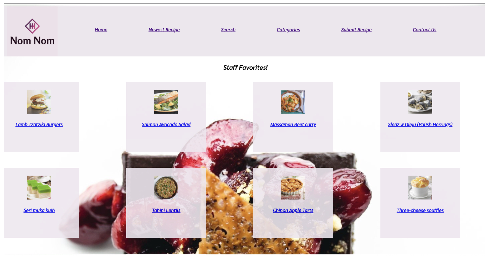
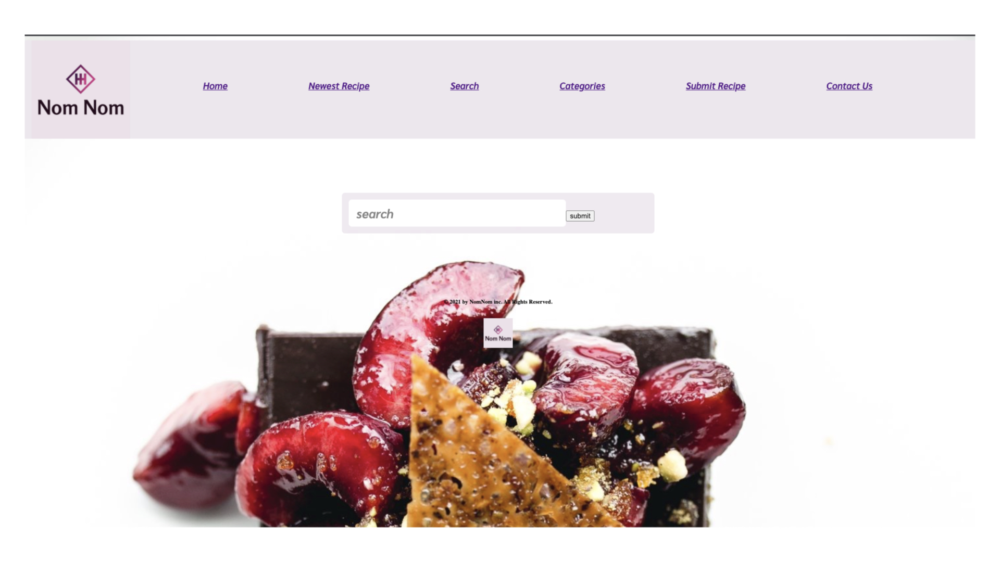
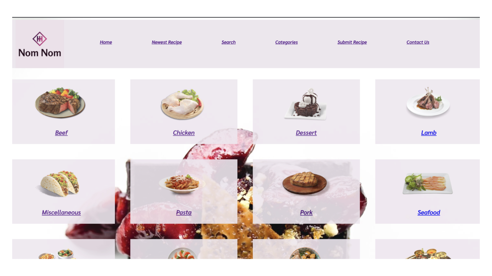
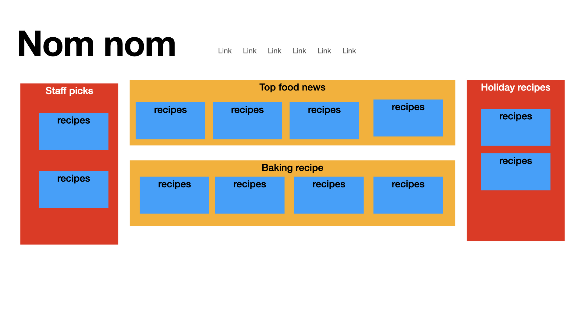
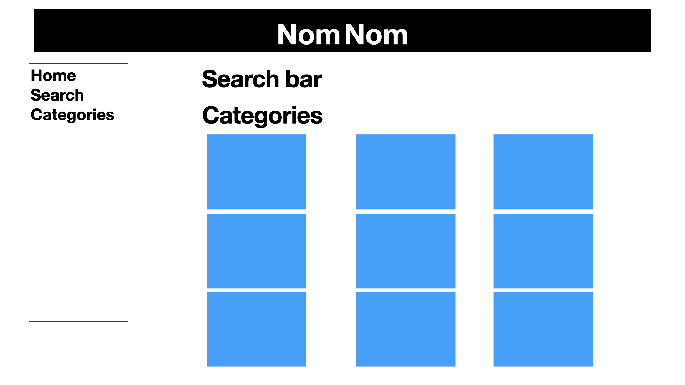
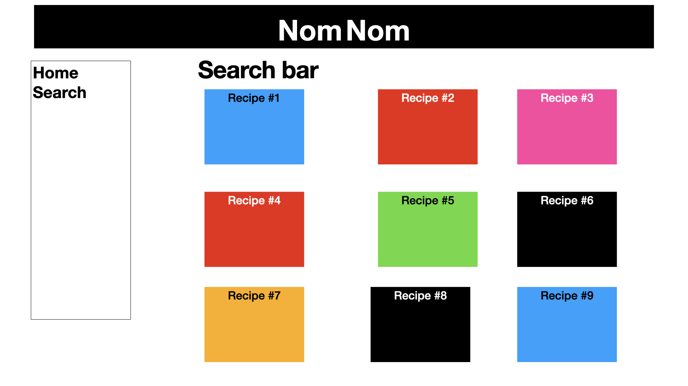
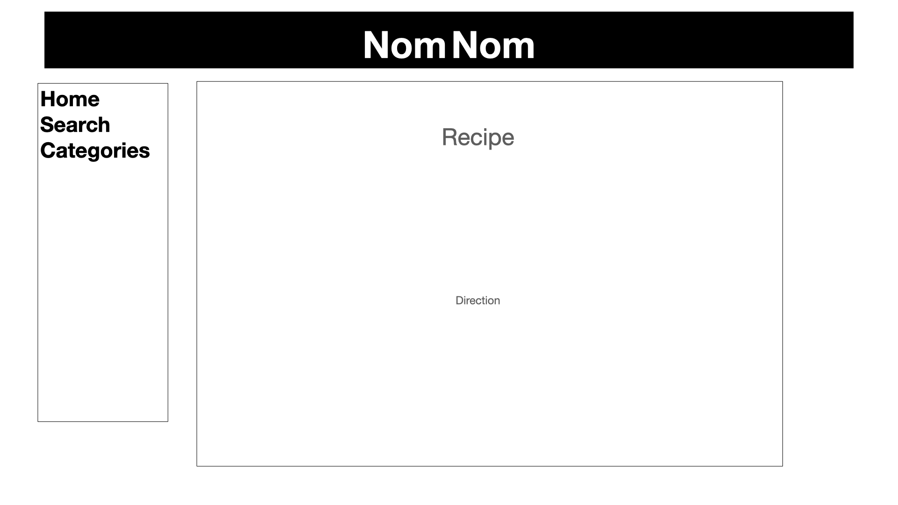

#Project 2 - Nom Nom Recipe Search

As a user your going to able to search up a recipe by name or ingrendent. also you'll be able to search by premade categorys. 

#Technologies

React js
CSS
heroku (deployemnt)

#Installation instructions 
open in the browser

https://nom-nom-recipes-1018.herokuapp.com/Home

#WireFrames

#Huddles and problems -
I had a major issue where I couldnt map out my api correctly, with help from steven we figured out that because everything I was trying to map out was a obj we had to dot into the obj from the json. another issue I was having was getting my CSS to work. alot of research later I was able to figure it out. css-tricks.com and mozilla helped me the most with the CSS.